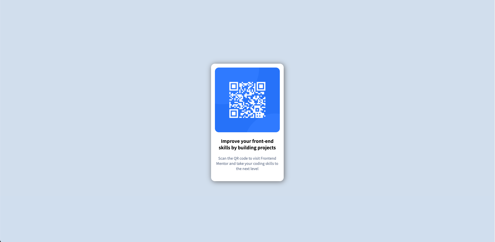

# Frontend Mentor - QR code component solution

This is a solution to the [QR code component challenge on Frontend Mentor](https://www.frontendmentor.io/challenges/qr-code-component-iux_sIO_H). Frontend Mentor challenges help you improve your coding skills by building realistic projects. 

## Table of contents

- [Overview](#overview)
  - [Screenshot](#screenshot)
  - [Links](#links)
- [My process](#my-process)
  - [Built with](#built-with)
  - [What I learned](#what-i-learned)
  - [Continued development](#continued-development)
- [Author](#author)
- [Acknowledgments](#acknowledgments)


## Overview

This is my version of the QR code beginner project, I tried to replicate my design as close to the original but I added box shadow around the container.

### Screenshot




### Links

- Solution URL: [Here](https://github.com/rzho17/qr-code-frontendmentor)
- Live Site URL: [Here](https://rzho17.github.io/qr-code-frontendmentor/)

## My process

I began by planning out how to layout my html, since I felt confident I could figure out a way to lay things out I just did it without writing it down on a piece of paper.

After laying thing out how I wanted them, I began to style my design as close as possible to the original and this was the result.

### Built with

- Semantic HTML5 markup
- CSS custom properties
- Flexbox


### What I learned

The biggest thing I struggled with was wondering why my body container would not align-items center after I had used display flex. After some googling I realized the body's height was only the max height of the content which was the container image. 

After adding a height of 100vh to the body and limiting the height of the container to be max content, I was able to center align the container.

```html
<body>
  <div class="container">
    <div class="qrCode">
      
    </div>
    <h1>
      Improve your front-end skills by building projects
    </h1>

    <p>
      Scan the QR code to visit Frontend Mentor and take your coding skills to the next level
    </p>
  </div>
</body>
```
```css
body {

    height: 100vh;

}

.container {
  height: max-content;
}
```

### Continued development

I still need to get more practice with learning about sizing in general with CSS and Flexbox.


## Author

- Github - [Here](https://github.com/rzho17)
- Frontend Mentor - [@rzho17](https://www.frontendmentor.io/profile/rzho17)


